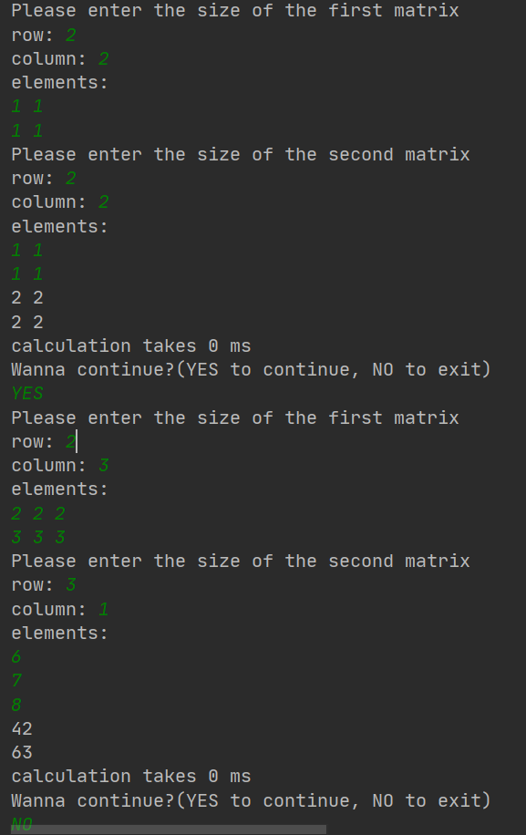
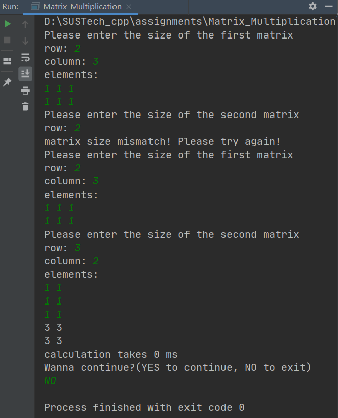
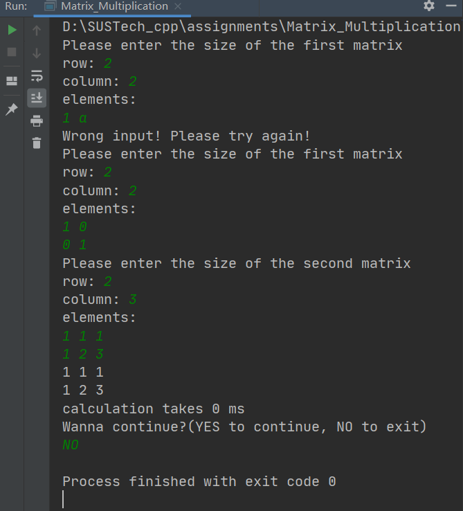

# OpenMXM

a optimized matrices multiplication

## Part One_Basic features

### struct matrix

```c++
struct matrix {
    int row;
    int column;
    float *elements;

    matrix(int a, int b) {
        row = a;
        column = b;
        elements = new float[a * b]{};
    }
};
```
Struct matrix has three member variables, row, column and elements with an initializing function. Here in every matrix we use one dimensional float array to store two dimensional matrix.

### compatibility demonstration

#### one run, multiple try

During one run, there can be multiple input. In the end of each calculation, you can print "YES" to continue or print "NO" to exit.



#### robust program

This program is robust and can detect whether your input is correct. If not, it won't crash but jump to the next loop and wait for you to input again.

##### matrix size mismatch



##### input value mismatch



## Part Two_Optimization Roadmap

Here we test each optimized version with two matrices each has 200 million elements(20000*10000 and 10000*20000).

### Version1.0_brutal force

Simply use the definition of matrix multiplication. It's very easy to implement but definitely has very low efficiency in time.

```c++
void m_product_column(float *c, const float *a, const float *b,int row1, int column1, int row2, int column2) {
    for (int i = 0; i < column2; ++i) {
        for (int j = 0; j < row1; ++j) {
            for (int k = 0; k < column1; ++k) {
                c[j * column1 + i] += a[j * column1 + k] * b[k * column2 + i];
            }
        }
    }
}
```

### Time Cost

Too long to wait! More than half and hour! Below we will see how to make it more and more effecient!

### Version2.0_row prior

In version1.0 we can see from the code that we simply use one colum of matrix b to multiply every row of matrix a to get a column elements of matrix c in one i loop. However, in each i loop, the memory access is not continuous. every loop in k, we jump the memory of b's element by a row(k * column2), and in every loop of j, we jump the memory of c's and a's element by a row(j * column1). This decrease the cache hit rate and result in low efficiency.

Therefore, based on this idea, we can do the optimization of memory access.

The first mind, we transform the calculation pattern from column prior(version1.0) to row prior. That to say, we access continuous memory as much as possible. We simply move one element in the row of a in j loop, b in k loop, this also increase the cache hit rate meanwhile. Moreover, apart from ```c++ c[cpos++] += a[apos] * b[bpos++] ```, there is no other multiplication. As is known, every plus and minus only cost one cpu cycle while every mulplication costs 4 cpu cycle. So, it can be predicted that version2.0's preformance is at least 4 times the previous.

```c++
void m_product_row(float *c, const float *a, const float *b,int row1, int column1, int row2, int column2) {
    int apos = 0;
    int bpos;
    int cpos = 0;
    for (int i = 0; i < row1; ++i) {
        bpos = 0;
        for (int j = 0; j < column1; ++j) {
            for (int k = 0; k < column2; ++k) {
                c[cpos++] += a[apos] * b[bpos++];
            }
            apos++;
            cpos -= column2;
        }
        cpos += column2;
    }
}
```

### Time Cost

249760 ms. Nearly 4min!

It seems that our idea of continous cache and replacing multiplication to plus and minus is of significant effect. Below time costs are all compare with this one.

### Version3.0