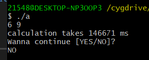
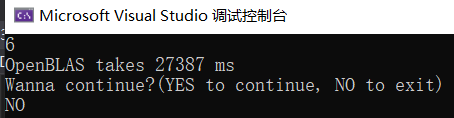

# OpenMXM

a optimized matrices multiplication

All our test here is between two matrix which both have about 200M elements.

All test are under O3 optimazation.

## Part One_Basic features

### struct matrix

```c++
struct matrix {
    int row;
    int column;
    float *elements;

    matrix(int a, int b) {
        row = a;
        column = b;
        elements = new float[a * b]{};
    }
};
```
Struct matrix has three member variables, row, column and elements with an initializing function. Here in every matrix we use one dimensional float array to store two dimensional matrix.

### compatibility demonstration

#### one run, multiple try

During one run, there can be multiple input. In the end of each calculation, you can print "YES" to continue or print "NO" to exit.


#### robust program

This program is robust and can detect whether your input is correct. If not, it won't crash but jump to the next loop and wait for you to input again.

##### matrix size mismatch


##### input value mismatch


## Part Two_Optimization Roadmap

Here we test each optimized version with two matrices each has 200 million elements(20000*10000 and 10000*20000).

### Version1.0_brutal force

Simply use the definition of matrix multiplication. It's very easy to implement but definitely has very low efficiency in time.

```c++
void m_product_column(float *c, const float *a, const float *b,int row1, int column1, int row2, int column2) {
    for (int i = 0; i < column2; ++i) {
        for (int j = 0; j < row1; ++j) {
            for (int k = 0; k < column1; ++k) {
                c[j * column1 + i] += a[j * column1 + k] * b[k * column2 + i];
            }
        }
    }
}
```

### Time Cost

Too long to wait! More than half and hour! Below we will see how to make it more and more effecient!

### Version2.0_row prior

In version1.0 we can see from the code that we simply use one colum of matrix b to multiply every row of matrix a to get a column elements of matrix c in one i loop. However, in each i loop, the memory access is not continuous. every loop in k, we jump the memory of b's element by a row(k * column2), and in every loop of j, we jump the memory of c's and a's element by a row(j * column1). This decrease the cache hit rate and result in low efficiency.

Therefore, based on this idea, we can do the optimization of memory access.

The first mind, we transform the calculation pattern from column prior(version1.0) to row prior. That to say, we access continuous memory as much as possible. We simply move one element in the row of a in j loop, b in k loop, this also increase the cache hit rate meanwhile. Moreover, apart from ``` c[cpos++] += a[apos] * b[bpos++] ```, there is no other multiplication. As is known, every plus and minus only cost one cpu cycle while every mulplication costs 4 cpu cycle. So, it can be predicted that version2.0's preformance is at least 4 times the previous.

```c++
void m_product_row(float *c, const float *a, const float *b,int row1, int column1, int row2, int column2) {
    int apos = 0;
    int bpos;
    int cpos = 0;
    for (int i = 0; i < row1; ++i) {
        bpos = 0;
        for (int j = 0; j < column1; ++j) {
            for (int k = 0; k < column2; ++k) {
                c[cpos++] += a[apos] * b[bpos++];
            }
            apos++;
            cpos -= column2;
        }
        cpos += column2;
    }
}
```

### Time Cost

260564 ms. Nearly 4.5min!


It seems that our idea of continous cache and replacing multiplication to plus and minus is of significant effect. Below time costs are all compare with this one.

### Version3.0_simple block

After we do the continous cache, naturally we come up with the idea of blocking. So first we do a simple blocking to the inner loop.

```c++
void mxm_block(float *c, const float *a, const float *b, int row1, int column1, int row2, int column2) {
    int apos = 0;
    int bpos;
    int cpos = 0;
    for (int i = 0; i < row1; ++i) {
        bpos = 0;
        for (int j = 0; j < column1; j++) {
            register float common = a[apos];
            for (int k = 0; k < column2; k += 4) {
                c[cpos++] += common * b[bpos++];
                c[cpos++] += common * b[bpos++];
                c[cpos++] += common * b[bpos++];
                c[cpos++] += common * b[bpos++];
            }
            apos++;
            cpos -= column2;
        }
        cpos += column2;
    }
}
```

Here in order to improve the efficiency to fetch data, we use register to store repeated a[apos] which is the same in one total inner loop. This can indreasing the efficiency when we fetch the value from a register other than from memory to do the multiplication.

### Time Cost


Nearly 4 mins, a slight lift. It seems that our blocking isn't enough, repetitive data that can be stored by register should be more to improve the reuse of data. Also, we should find a large scale of partitional matrix that can be stored into acache and do the cacualtion at one time.

## Summary of above

From above we can see that using a one-dimensional array to store matrix can have more efficiency in some means, for example, in our version2.0(row prior), in this version, we fully use the feature of one-dimensional array, it's continuity of data allow us to fetch data continuously and accurately. However, when we are going to do the block optimization. one-dimensional array exposes its flaw. Above version3.0 simple_block may not show the problem, because its blocking is so simple and actually don's make much sense. When we do block 1x4 and further 4x4. The code will like this:

```c++
void mxm_block(float *c, const float *a, const float *b,int row1, int column1, int row2, int column2) {
    int apos = 0;
    int bpos;
    int cpos = 0;
    for (int i = 0; i < row1; ++i) {
        bpos = 0;
        for (int j = 0; j < column1; j += 4) {
            for (int k = 0; k < column2; k += 4) {
                c[cpos++] += a[apos] * b[bpos] + a[apos + 1] * b[bpos + column2] + a[apos + 2] * b[bpos + column2 * 2] + a[apos + 3] * b[bpos + column2 * 3];
                c[cpos++] += a[apos] * b[++bpos] + a[apos + 1] * b[bpos + column2] + a[apos + 2] * b[bpos + column2 * 2] + a[apos + 3] * b[bpos + column2 * 3];
                c[cpos++] += a[apos] * b[++bpos] + a[apos + 1] * b[bpos + column2] + a[apos + 2] * b[bpos + column2 * 2] + a[apos + 3] * b[bpos + column2 * 3];
                c[cpos++] += a[apos] * b[++bpos] + a[apos + 1] * b[bpos + column2] + a[apos + 2] * b[bpos + column2 * 2] + a[apos + 3] * b[bpos + column2 * 3];
            }
            apos += 4;
            cpos -= column2;
        }
        cpos += column2;
    }
}
```

From which we can see there are multiplications to find the position. As is mentioned above, multiplication takes much more time than plus or minus. So, it's no longer proper choose one-dimensional array to do further blocking and other optimization. Which means that we will trace back to using normal two dimensional arrays to store matrix.

After analyzing, we define our matrix in this way:

```c++
struct matrix {
    int row;
    int column;
    float **elements;

    matrix(int a, int b) {
        row = a;
        column = b;
        elements = new float*[row];
        for (int i = 0; i < row; ++i) {
            elements[i] = new float[column]{};
        }
    }
};
```

Also, we need to change corresponding functions to fit this change. After testing, among version 1.0, 2.0 and 3.0, there's no obvious difference in time cost.

### Version4.0_1x4 blocking

In this version, we do a 1x4 blocking, every time we jump four elemets of matrix a's row and corresponding four rows of matrix b. Why do we do this way? From above simple_blocking we can find that in every j loop we just use the same element ```a[apos]```, so next step we can jump 4 j loops a time and get four repeatedly used element ```a[i][j] to a[i][j + 3]```. 

```c++
void mxm_block(float **c, float **a, float **b, int row1, int column1, int row2, int column2) {
    int i, j ,k;
    for (i = 0; i < row1; i ++) {
        for (j = 0; j < column1; j += 4) {
            register float reg1 = a[i][j], reg2 = a[i][j + 1], reg3 = a[i][j + 2], reg4 = a[i][j + 3];
            for (k = 0; k < column2; k += 4) {
                c[i][k] += reg1 * b[j][k] + reg2 * b[j + 1][k] + reg3 * b[j + 2][k] + reg4 * b[j + 3][k];
                c[i][k + 1] += reg1 * b[j][k + 1] + reg2 * b[j + 1][k + 1] + reg3 * b[j + 2][k + 1] + reg4 * b[j + 3][k + 1];
                c[i][k + 2] += reg1 * b[j][k + 2] + reg2 * b[j + 1][k + 2] + reg3 * b[j + 2][k + 2] + reg4 * b[j + 3][k + 2];
                c[i][k + 3] += reg1 * b[j][k + 3] + reg2 * b[j + 1][k + 3] + reg3 * b[j + 2][k + 3] + reg4 * b[j + 3][k + 3];
            }
        }
    }
}
```

### Time Cost


Surprisingly we save on about 1/4 of the prevoius one and 1/3 from version2.0.

### Version5.0_1x4 blocking with OpenMP

After see the huge progress from 1x4 blocking, we here see that the outer loop i haven't been optimized. Therefore, we can use opemmp to let it loop and do calculation in parallel. Idealy we can see huge progress from prevoius version again.

### Time Cost



Nearly 2 mins. From the initial version2.0 we have optimized twice!

### Test with OpenBLAS



we can see from the above pic that openblas take about 30 s to do matrix multiplication of 200M elements.

The reuslt of openblas and our version5.0 is the same, which means that our idea and implement is correct.

Analyzing the time, we can see that in 200M scale, openblas takes 1/4 of our algorithm. But in 1M scale, version5.0's time cost can catch up with openblas which is 22 and 33 ms seperately.

## Summary

In this assignment we are working on how to optimizing matrix multiplication and how different ideas works and why. Up to now, we have worked out 5 versions and multiple ways to do the matrix multiplication, from brutal force to OpenBLAS. And each of them differs in efficiency, let's summarize from the data below.

200M:

|  method   | result  | time cost |
|  :----:  | :----:  | :----: |
| brutal_force  | 6 9 | ~ |
| row_prior  | 6 9 | 260564 ms |
| simple_blocking  | 6 9 | 257978 ms |
| 1x4_blocking  | 6 9 | 186714 ms |
| 1x4_openmp  | 6 9 | 146671 ms |
| OpenBLAS  | 6 9 | 27387 ms |

1M:

|  method   | result  | time cost |
|  :----:  | :----:  | :----: |
| brutal_force  | 6 9 | 1051 ms |
| row_prior  | 6 9 | 207 ms |
| simple_blocking  | 6 9 | 217 ms |
| 1x4_blocking  | 6 9 | 104 ms |
| 1x4_openmp  | 6 9 | 22 ms |
| OpenBLAS  | 6 9 | 33 ms |